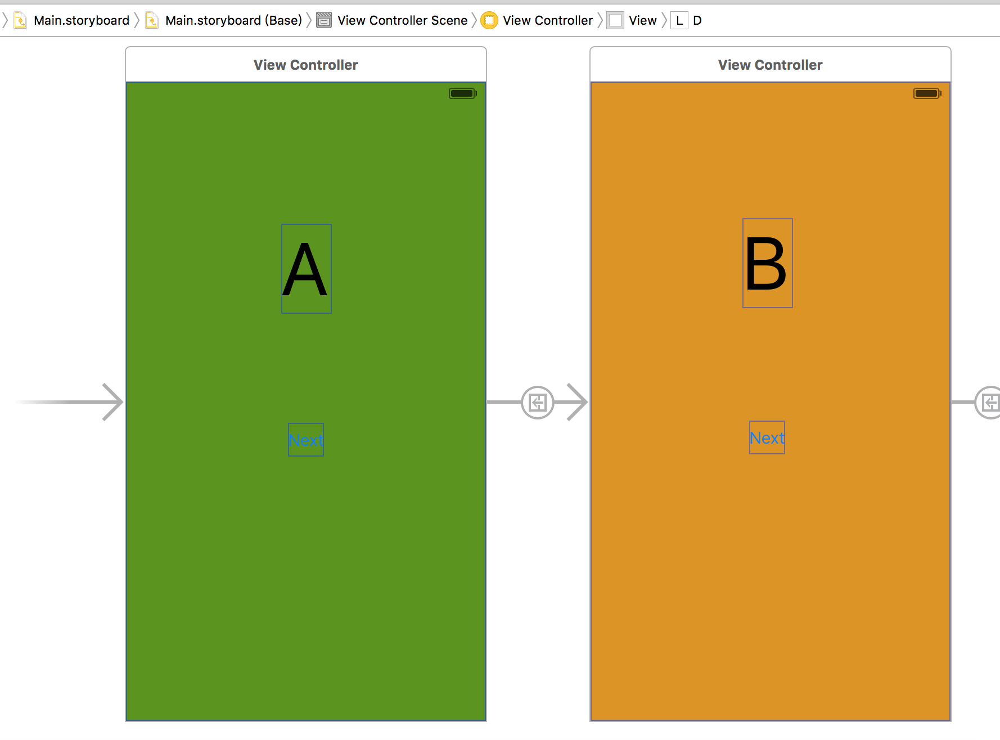
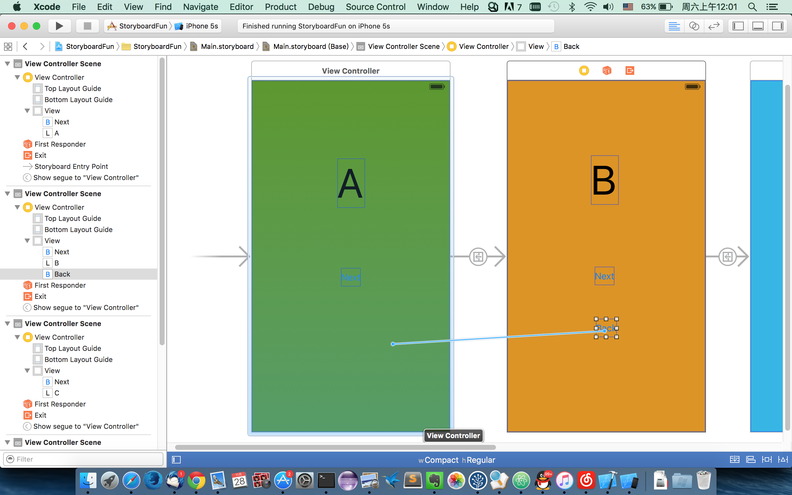
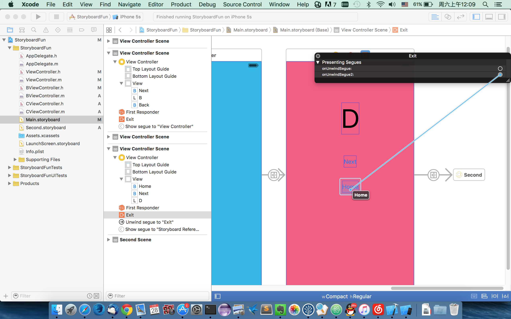

# iOS Unwind Segue

使用Storyboard开发iOS程序的时候，使用segue可以非常方便地进行ViewController之间的跳转。

通常从一个controller跳到另外一个controller，使用show(push) segue。像下面这样：



图中是从A跳转到B，如果需要从B回到A，很简单的方法就是：

```
[self dismissViewController:self animation:YES];
```

如果在Storyboard上面实现回退的话，我第一次是这样的：



扑街，然后我发现这样并不是返回，而是重新实例化了一个A。栈结构现在相当于是：ABA.

如果再从A到B的话，反复几次的话就是这样：ABABABAB。

惨，严重的内存泄露。

这时候就需要用到`Unwind Segue`。

1. 在需要回到的ViewController定义一个方法，参数是`UIStoryboardSegue *`

```
#import <UIKit/UIKit.h>

@interface ViewController : UIViewController

- (IBAction)onUnwindSegue:(UIStoryboardSegue *)segue;

@end
```

2. Control Drag 连线到`ViewController`上方的`Exit`的那个东东那里。



OK 大功告成。

这时候点击返回后，前面的ViewController的`dealloc`方法都会被调用了。

[TestProject in Github](https://github.com/skyhacker2/StoryboardFun)

